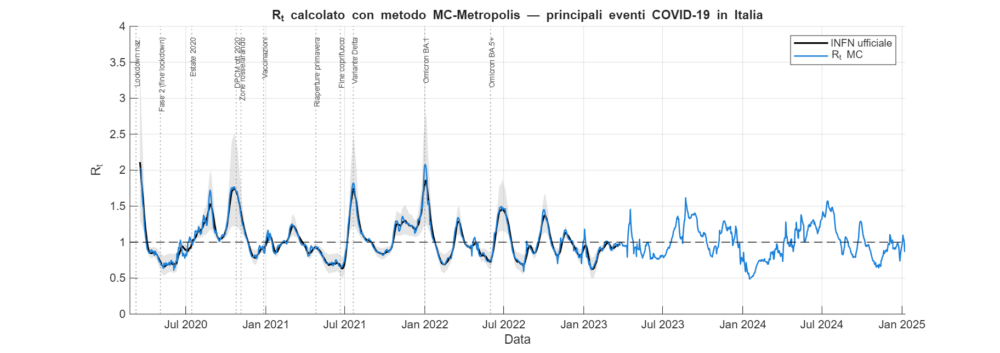

# Estimating $R_t$ for the COVID-19 Epidemic in Italy

**Two methods compared: an SIR-based approximation and a Metropolis Monte Carlo estimator.**

Final project for **Modellazione e Simulazioni Numeriche** (Numerical Modelling and Simulation),
academic year 2025/2026 — *Corso di Laurea Magistrale in Scienze Informatiche*
(MSc in Computer Science), **Università degli Studi di Parma**.

> **Language note.** The report, the source comments and the figure labels are in **Italian**.
> This README is the English entry point; it explains what the project does, how it is laid out
> and how to reproduce the results. The material itself is not translated.



---

## What this is

A numerical-modelling project that reconstructs the time-varying reproduction number $R_t$ for
the COVID-19 epidemic in Italy from public surveillance data, using two independent estimators
implemented from scratch in MATLAB, and benchmarks both against the official
[INFN CovidStat](https://covid19.infn.it/sommario/rt.html) $R_t$ series.

**Coverage:** both estimators run on the DPC series, so the results span 24 Feb 2020 – 8 Jan 2025.
The ISS dataset shipped here reaches 6 Jan 2026 and feeds the alternative SIR variants; the INFN
reference series covers 18 Mar 2020 – 30 Mar 2023.

---

## The two methods

### Method 1 — SIR approximation (`Codice/M1_SIR`)

Starting from the SIR compartmental model and assuming $S/N \approx 1$, the reproduction number
reduces to a local finite-difference formula on the number of currently infected individuals:

$$R_t \approx 1 + T_R \cdot \frac{\Delta I}{I}$$

where $T_R = 1/\gamma$ is the mean removal time. $I(t)$ is taken directly from the DPC
`totale_positivi` field (active cases); $R_t$ is computed on raw data and then smoothed with a
causal 7-day moving average.

The critical modelling choice is $T_R$, which is **not constant** — it shrinks as the dominant
variant changes. The project therefore splits the epidemic into five phases, each with its own
$T_R$ and an explicit uncertainty band:

| # | Phase | Period | $T_R$ (days) |
|---|---|---|---|
| 1 | Ancestral + Alpha | 29 Jan 2020 – 20 Jul 2021 | 9.7 ± 2.0 |
| 2 | Delta | 21 Jul 2021 – 31 Dec 2021 | 7.0 ± 1.0 |
| 3 | Omicron BA.1/BA.2 | 1 Jan 2022 – 31 May 2022 | 6.0 ± 1.0 |
| 4 | Omicron BA.5+ | 1 Jun 2022 – 30 Mar 2023 | 5.0 ± 1.0 |
| 5 | Post-INFN (XBB+) | 31 Mar 2023 – 8 Jan 2025 | 5.0 ± 1.0 |

Phase 1 uses the value calibrated by Lazzizzera (2021); phases 2–4 rescale it by the
generation-time ratios reported in Xu et al. (2023). Two alternative reconstructions of $I(t)$
from ISS incidence data (pre- and post-smoothing) are also implemented and selectable via a flag.

### Method 2 — Metropolis Monte Carlo (`Codice/M2_MCMC`)

The approach used by ISS/FBK, here in a simplified single-day form. The expected number of cases
on day $t$ is a convolution of past incidence with the generation-time distribution:

$$\lambda(t) = R_t \sum_{s=1}^{25} \varphi(s)\, C(t-s)$$

with $\varphi(s)$ a Gamma distribution ($\alpha = 1.87$, $\beta = 0.28$; Guzzetta & Merler, 2020),
truncated at 25 days and discretised by numerical quadrature over $[s-\tfrac12,\, s+\tfrac12]$.

Assuming a Poisson likelihood for the observed counts, $R_t$ is sampled **independently for each
day** with a Metropolis random walk (uniform proposal of half-width 1.5, 5000 steps, 500 discarded
as burn-in); the posterior mean is then smoothed with a causal 7-day moving average.
Run-to-run MCMC variability is of order $10^{-3}$.

### How they compare

| Property | SIR | Monte Carlo |
|---|---|---|
| Input (as implemented) | DPC active cases (`totale_positivi`) | DPC new cases (`nuovi_positivi`) |
| Key parameter | $T_R$ (per variant) | $\varphi(s)$ (Gamma) |
| Max error vs. INFN | 0.2 – 0.6 | 0.20 – 0.27 |
| Phase shift vs. INFN | ~1 week **late** | ~1 week **early** |
| Parametric uncertainty | $T_R \pm \Delta T_R$ band | Determined by $\varphi(s)$ |

**Main findings.** The SIR method is simple to implement and interpret, but its accuracy hinges
entirely on $T_R$: applying the ancestral-variant value (9.7 days) to Omicron data overestimates
$R_t$ systematically, by up to 60% at wave peaks, because $R_t$ scales linearly with $T_R$.
The Monte Carlo estimator does not depend on $T_R$ at all and stays closer to the official
series throughout (maximum error 0.201 in phase 1 to 0.269 in phase 3). The two are
complementary: SIR needs nothing but the active-case count, while Monte Carlo exploits the
temporal structure of transmission at the cost of a heavier implementation.

The residual phase shift is structural, not a bug: ISS and DPC index cases by
sampling/reporting date, whereas the official computation uses symptom-onset date.

---

## Repository layout

```
Codice/                      MATLAB sources
├── carica_dati.m            loads ISS CSV or DPC JSON + INFN reference series
├── definisci_fasi.m         the five epidemic phases (dates, T_R, colours)
├── M0_Aux/                  auxiliary figures: case counts, phi(s), Rt vs. policy events
├── M1_SIR/                  Method 1 — main_sir.m + the three Rt variants
└── M2_MCMC/                 Method 2 — main_mc.m, metropolis_rt.m, phi_gamma.m
Dati/                        raw datasets + a note on their provenance (Fonti_Dati/)
Teoria/                      standalone note on the Metropolis algorithm (LaTeX + PDF)
Relazione_Covid_Seligardi.*  the full report, LaTeX source and compiled PDF
```

Folder and file names are kept in Italian, matching the paths referenced in the report.

Every document is published as both LaTeX source and compiled PDF. The report builds from the
repository root as-is: `\graphicspath` already points at the figure directories under `Codice/`,
so the PNGs produced by the scripts are picked up automatically.

## Data

| File | Contents | Source |
|---|---|---|
| `Dati/dpc-covid19.json` | Daily national figures (`nuovi_positivi`, `totale_positivi`, hospitalisations, deaths, swabs), 24 Feb 2020 – 8 Jan 2025 | [pcm-dpc/COVID-19](https://github.com/pcm-dpc/COVID-19) |
| `Dati/iss-covid19.csv` | Daily new cases by sampling/diagnosis date, 29 Jan 2020 – 6 Jan 2026 | [ISS EpiCentro](https://www.epicentro.iss.it/coronavirus/sars-cov-2-sorveglianza-dati) |
| `Dati/infn-rt.csv` | Official $R_t$ with 95% CI, 18 Mar 2020 – 30 Mar 2023 | [INFN CovidStat](https://covid19.infn.it/sommario/rt.html) |

Method 2 uses DPC `nuovi_positivi` as a proxy for the ISS symptomatic series, which is not
published as a downloadable file. This is sound rather than a compromise: since
$R_t = C(t) / \lambda_{\text{base}}(t)$, any series proportional to true incidence yields the
same $R_t$ — only the statistical precision changes ($\sigma_{R_t} \sim 1/\sqrt{C(t)}$).

## Running the code

Requires **MATLAB R2019b or later** (for `movmean` with a directional window). No toolboxes are
needed — the Gamma distribution is discretised by quadrature specifically to avoid the Statistics
Toolbox. GNU Octave is not supported: the code relies on `datetime`/`NaT`, which Octave implements
only partially.

```matlab
cd Codice/M1_SIR
main_sir          % Method 1: per-phase plots, combined plot, error metrics vs. INFN

cd ../M2_MCMC
main_mc           % Method 2: same outputs, MCMC-based
```

Both scripts cache their results in a `.mat` file next to the script (`rt_sir_results.mat`,
`rt_mc_results.mat`) and reload it on subsequent runs. **Delete the `.mat` file to force a full
recomputation** — the Monte Carlo run takes a few minutes over the whole period.

Figures are written as PNG next to the script that produces them.

## References

Full bibliography in the report. Key sources:

- I. Lazzizzera, *The SIR model towards the data: One year of Covid-19 pandemic in Italy case study and plausible "real" numbers*, [arXiv:2106.01602v2](https://arxiv.org/abs/2106.01602), 2021.
- X. Xu, Y. Wu et al., *Assessing changes in incubation period, serial interval, and generation time of SARS-CoV-2 variants of concern*, BMC Medicine 21:375, 2023. [doi:10.1186/s12916-023-03070-8](https://doi.org/10.1186/s12916-023-03070-8)
- S. W. Park et al., *Inferring the differences in incubation-period and generation-interval distributions of the Delta and Omicron variants of SARS-CoV-2*, PNAS 120(22), 2023. [doi:10.1073/pnas.2221887120](https://doi.org/10.1073/pnas.2221887120)
- A. Cori, N. M. Ferguson, C. Fraser, S. Cauchemez, *A New Framework and Software to Estimate Time-Varying Reproduction Numbers During Epidemics*, Am. J. Epidemiol. 178(9):1505–1512, 2013. [doi:10.1093/aje/kwt133](https://doi.org/10.1093/aje/kwt133)
- D. Cereda et al., *The early phase of the COVID-19 outbreak in Lombardy, Italy*, [arXiv:2003.09320](https://arxiv.org/abs/2003.09320), 2020.
- Ş. Keske et al., *Duration of infectious shedding of SARS-CoV-2 Omicron variant and its relation with symptoms*, Clin. Microbiol. Infect. 29:221–224, 2023. [doi:10.1016/j.cmi.2022.07.009](https://doi.org/10.1016/j.cmi.2022.07.009)
- G. Guzzetta, S. Merler, *Stime della trasmissibilità di SARS-CoV-2 in Italia*, FBK, 2020. [PDF](https://www.epicentro.iss.it/coronavirus/open-data/rt.pdf)
- UKHSA, *COVID-19: infectious period, asymptomatic and symptomatic transmission*, rapid evidence review, 2023. [link](https://www.gov.uk/government/publications/covid-19-infectious-period-asymptomatic-and-symptomatic-transmission)

## License

This repository is dual-licensed, because it contains both software and written work.

| What | License | File |
|---|---|---|
| The MATLAB sources under `Codice/` | MIT | `LICENSE` |
| The report, the theory note, the data provenance note and the figures produced by the code | [CC BY 4.0](https://creativecommons.org/licenses/by/4.0/) | `LICENSE-CC-BY-4.0.txt` |
| Everything else authored here (this README, configuration files, cached `.mat` results) | MIT | `LICENSE` |

Copyright © 2026 Samuel Seligardi. To reuse a figure or quote the report under CC BY 4.0, credit
*Samuel Seligardi, «Calcolo dell'$R_t$ per l'epidemia di COVID-19 in Italia», 2026* and link back
to this repository.

The datasets under `Dati/` are redistributed from their original publishers and remain subject to
their terms (DPC: CC BY 4.0; ISS and INFN: see the linked pages in the table above).

## Author and academic context

**Samuel Seligardi**

| | |
|---|---|
| Course | Modellazione e Simulazioni Numeriche (Numerical Modelling and Simulation) |
| Course code | 18339 |
| Academic year | 2025/2026 |
| Programme | Corso di Laurea Magistrale in Scienze Informatiche (MSc in Computer Science) |
| Institution | Università degli Studi di Parma |
| Submitted | March 2026 |

This repository is the archived exam submission, published for reference. It is coursework, not
a maintained scientific tool: the estimates are not intended for epidemiological decision-making,
and the official Italian $R_t$ figures remain those published by ISS and INFN.
